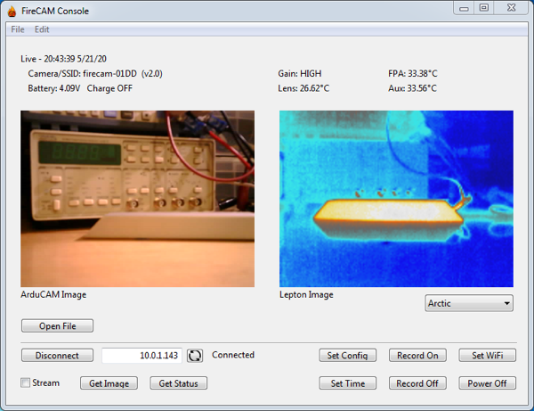
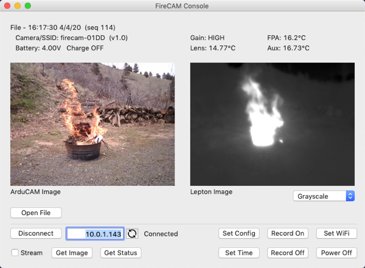
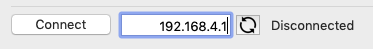
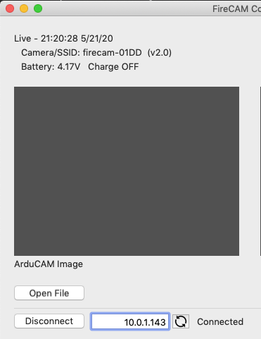
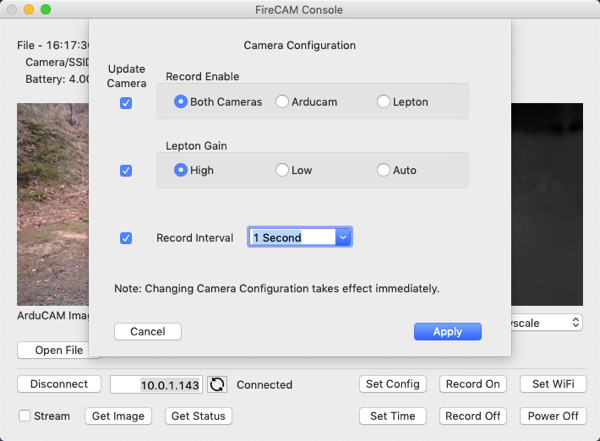
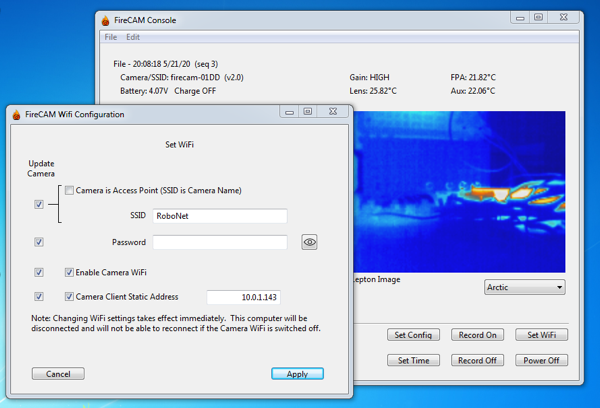

## FireCAM Application Program
This directory contains the FireCAM application program, compiled as 64-bit binaries for Windows and OS X platforms and its source code written for the Xojo development environment.

The Application program provides two functions.

1. Remote Camera Control - Get status and control the camera remotely including the ability to view live images from the camera.
2. Simple File Viewing - View files that have been copied from the camera's Micro-SD card to the computer.

### Running the application
The pre-built binary files are found in the `Builds - firecam.xojo_binary_project`sub-directory.  For Windows, double-click the `firecam.exe` file.  For Mac, double-click the `firecam` application icon.

### File Display
The `Open File` button opens a file chooser pop-up allowing selection of a camera json file.  The status area above the images is updated from the file's metadata.

Note: A sample json image file is in the `pictures` sub-directory.

### Remote Camera Control
The computer the application is running on must be on the same network as the camera.  The application must be configured with the camera's IP address.

Clicking the refresh button to the right of the the IP text field will display the current address with the last octet set to '1'.  Clicking the `Connect` button will attempt to connect to the camera.  The camera's current status is displayed above the image area upon successful connection.

Once connected the camera controls are active.

* `Get Image` - Gets a pair of images from the camera and displays them along with metadata above the images.
* `Get Status` - Gets the camera status and displays it above the images.  The displayed status indicates if the camera is currently recording or not.
* `Poweroff` - Commands the camera to power down (a pop-up message box is displayed first for verification).
* `Record On` - Starts a recording session.  A Micro-SD card must be inserted or this button will have no effect.
* `Record Off` - Ends a recording session.
* `Set Config` - Queries the camera for its current camera settings and displays a settings window to make changes.  
* `Set Time` - Sets the camera time from the computer time.
* `Set WiFi` - Queries the camera for its current WiFi and network settings and displays a settings window to make changes.
* `Stream` - Clicking this checkbox causes the application to continuously request an image every second.  The application will not request a new image until the previous request has been fulfilled so this may result in slower than once/second updates.

#### Set Config

Only items with the associated `Update Camera` checkbox selected will be updated if Apply is pressed.

#### Set WiFi

Only items with the associated `Update Camera` checkbox selected will be updated if `Apply` is pressed.  Changing the Camera is Access Point checkbox will reset the `SSID` text field with the current SSID for either AP or client mode.

Note: The `Password` text field from the camera is not populated with the camera's existing password.