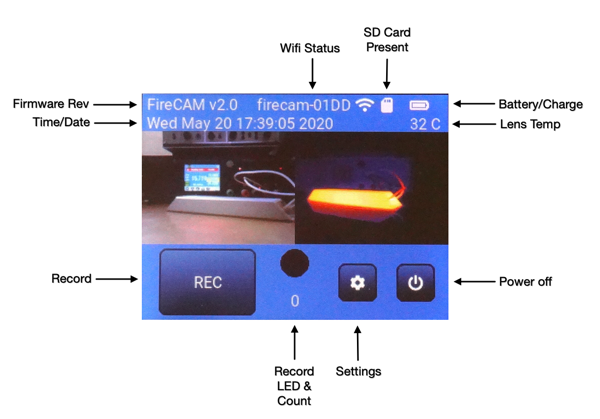
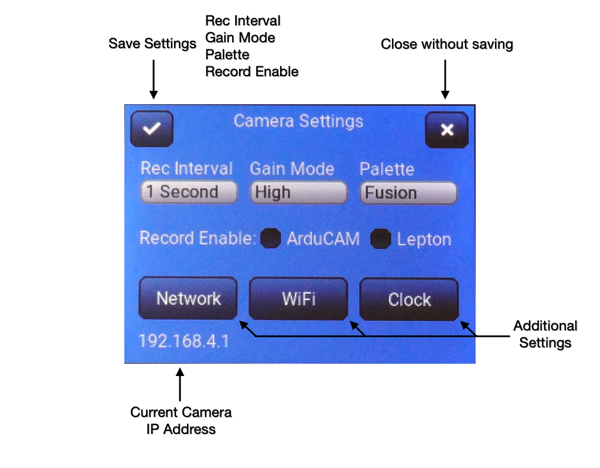
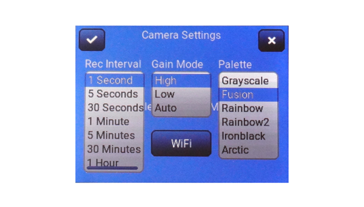
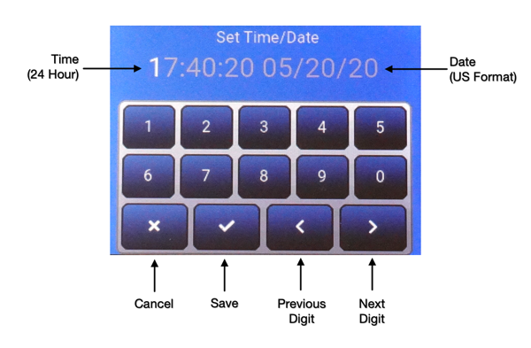
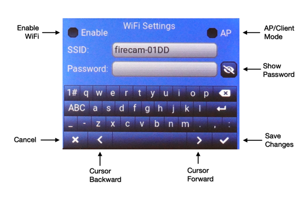
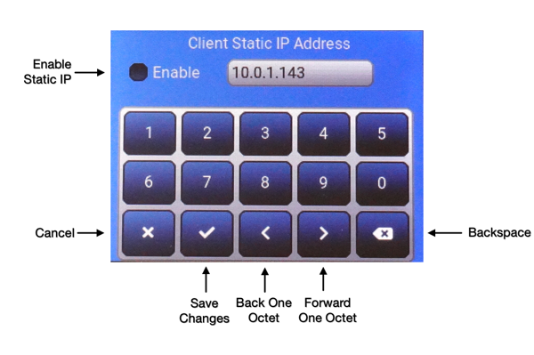

## FireCAM Firmware
This directory contains the firmware source files, build support and pre-compiled binary files ready for programming into hardware using EspressIF tools.

Firmware is written in C using the EspressIF v3.3.2 IDF (which must be installed on your computer) and the LittlevGL v6.1.1 GUI library (included here).  The firwmare consists of several concurrently operating FreeRTOS tasks that communicate using notifications, shared buffers and mutex protected data structures.

* components - Support libraries and modules.
* main - Primary task modules.
* precompiled - Contains the pre-compiled binary files copied from the build directory (not included here).
* sdkconfig - IDF build configuration.  You will have to run this, at least, to set the USB Serial device for your camera.
* version.txt - Firmware version source file.

The EspressIF IDF documentation, including instructions for installing and building, can be found [here](https://docs.espressif.com/projects/esp-idf/en/v3.3.2/index.html).

### Local Control
Pressing the power button applies power to the camera.  It must be held until the firmware boots and sets a hold signal to keep power applied until it is ready to poweroff the camera (from a user action, remote command or low-battery condition).  This requries about 2-3 seconds.  The LCD backlight is switched on when the hold signal is asserted.

#### Main Screen

The camera's touch controls are fairly intuitive.  Functionality is split into several screens. The main screen is displayed after the camera boots. It displays an image updated once per second from both cameras, provides status information and controls to start/stop recording, enter the settings screens and power-off the camera.  The camera may also be powered off by pressing and holding the power button for more than two seconds.  A power-off screen is displayed when the camera powers down.



* Battery/Charge - An estimate of the battery capacity is shown in the battery icon (0, 25, 50, 75, 100%) and a charge icon appears while the camera is charging the battery from the USB port.
* Firmware Rev - revision as contained in the version.txt file.
* Lens Temp - Temperature of the external TMP36 sensor.
* Power Button - Immediately powers down the camera.
* Record Button - Starts and stops recording.
* Record LED and Count - A simulated red LED is lit while recording and the number of images recorded during this session is displayed below it.
* SD Card Present - An icon shows when a Micro-SD Card has been inserted into the camera and recording can be started.  A pop-up messagebox is displayed if recording is attempted without an installed card.
* Settings Button - Displays the camera main settings screen.
* Time/Date - Displays the current time and date maintained by the camera.  This information is used to construct a unique directory for each recording session.
* WiFi Status - The current selected SSID is displayed.  When the camera is configured as an Access Point this is also the camera name.  A WiFi icon is displayed when the WiFi is active.

By default each camera is named ```firecam-HHHH``` where the 4-character hex string `HHHH` are from the ESP32's unique SoftAP Mac address.

#### Main Settings Screen



The main settings screen allows configuration of camera operating parameters.  The parameters, along with the time, are maintained by the battery-backed RTC chip when the camera is powered down.

* Additional Settings Buttons - These open additional settings screens.
* Close Without Saving Button - Returns to the main screen and discards any changes made to the Recording Interval, Gain Mode, Palette or Record Enable.
* Current Camera IP Address - Displays the Camera's IP address when it is acting as an Access Point.  Displays the Camera's IP address (either DHCP or static) when it is a client and connected to another Access Point.
* Save Settings - Save the values displayed for the Recording Interval, Gain Mode, Palette and Record Enable.

Camera Parameters modifed by this screen include the following.

* Rec Interval - Configures the time between recorded images when the camera is recording.   These values range from 1 second to 1 hour.
* Gain Mode - Configure the Lepton Gain Mode (please refer to the Lepton documentation for a detailed descripton of Gain Mode).
* Palette - Configures the false color palette used to display images from the Lepton on the main screen.
* Record Enable - Allows control of what camera images are saved during recording.  This may be useful, for example, to disable the ArduCAM when taking timelapse images at night.  One or both cameras must be selected.



#### Clock Settings Screen



The Clock settings screen allows setting the camera's time and date. The time and date are set by entering them from left to right using the numeric keypad.  The currently selected digit is highlighted and automatically moves to the next digit as numbers are entered.  The screen will not allow setting illegal times or dates.

* Cancel Button - Returns to the main settings screen without changing the time and date.
* Next Digit Button - skips ahead to the next digit.
* Previous Digit Button - backs up one digit.
* Save - Saves the currently displayed time and date to the camera and RTC chip then returns to the main settings screen.

#### Wifi Settings Screen



The Wifi settings screen allows enabling or disabling WiFi, configuring the camera as an Access Point or client, and setting the camera's SSID and WPA password.  Note that it may be easier to use a stylus on the camera's resistive touch screen for entering information on this screen.

* AP/Client Mode Checkbox - Selecting this checkbox configures the camera as an Access Point that can support one client via DHCP.  De-selecting this checkbox configures the camera as a client that will attempt to connect to an Access Point.
* Cancel - Returns to the main settings screen without changing the WiFi configuration.
* Cursor Backward Button - Moves the cursor left one character position in the selected text box.
* Cursor Forward Button - Moves the cursor right one character position in the selected text box.
* Enable WiFi Checkbox - Selecting this checkbox enables the camera's WiFi interface.  De-selecting this checkbox disables the camera's WiFi interface.
* Password Text Box - Click in this to select it and enter up to a 32-character password.  When the camera is configured as an Access Point this is the password the connecting computer will use.  When the camera is configured as a client this is the password the camera will use.
* Save Changes Button - Saves the displayed WiFi configuration and returns to the main settings screen.  Restarts the WiFi as necessary with the new configuration.
* Show Password Button - Toggles showing or hiding the contents of the Password text box.
* SSID Text Box - Click in this to select it and enter up to a 32-character SSID.  When the camera is configured as an Access Point this is the SSID the camera will broadcast for the connecting computer to use.  When the camera is configured as a client this is the SSID the camera will attempt to connect with.

#### Network Settings Screen



The Network settings screen allows selecting between DHCP and Static IP addresses when the camera is configured as a client to another Access Point, and setting the static IP address.  A netmask of ```255.255.255.0``` is assumed by this version of the firmware.  The camera's current static IP address is displayed with a cursor at the end of the final octet.  Changes are made using the numeric keypad.  The screen will not allow creation of an illegal IP address.

* Backspace Button - Deletes the character immediately preceeding the cursor.  Sets the octet to 0 if the all characters in the octet are deleted.
* Back One Octet Button - Moves the cursor past the end character of the preceeding Octet value.
* Cancel Button - Returns to the main settings screen without changing the Network configuration.
* Enable Static IP Checkbox - Selecting this checkbox enables the camera to use a Static IP address.  De-selecting this checkbox enables the camera to request an address using DHCP.
* Forward One Octet Button - Moves the cursor past the end character of the subsequent Octet value.
* Save Changes Button - Saves the displayed Network configuration and returns to the main settings screen.  Restarts the WiFi as necessary with the new configuration.


### Recording Files
Recorded images are saved as json-structured files with several objects.  Each file is typically 70-100 kBytes in length.

* Metadata - Information about the camera and its environment.
* Visual Image - The variable length jpg image from the ArduCAM is formatted using Base-64.
* Lepton Radiometric Image - The 38,400 byte 16-bit per pixel radiometric (temperature) data from the Lepton is formatted using Base-64.
* Lepton Telemetry Data - The 480 byte 16-bit per word telemetry package containing information about the camera at the time the image was recorded is formatted using Base-64.

#### Missing Json objects
Occasionally one or both of the camera's may fail to generate an image.  The ArduCAM occasionally fails to generate a legal jpeg images (reason unknown).  The Lepton will not generate images while it is performing a flat-field correction.  If either or both of these occurs then the related object is not included in the file.

#### Recording Directory Layout
Files from one recording session are stored in two-level directory structure at the root of the Micro-SD card.  The top-level directory name is created from the current date and time.

```session_YY_MM_DD_HH_MM_SS```

Files are grouped in sets of 100 files per sub-directory under that.  Each sub-directory is named with an incrementing number starting at 0.  This is to mitigate performance issues with the underlying FAT-FS library as it scans a directory looking for duplicate file names.

```group_NNNN```

Files are named with an incrementing number starting at 0.

```img_MMMMM.json```

#### File Format
A complete file is shown below.  Most of the Base-64 data is omitted for clarity.

```
{
  "metadata": {
    "Camera": "firecam-01DD",
    "Version": "2.0",
    "Sequence Number": 0,
    "Time": "21:18:39",
    "Date": "5/18/20",
    "Battery": 4.170127868652344,
    "Charge": "OFF",
    "FPA Temp": 34.769981384277344,
    "AUX Temp": 34.969993591308594,
    "Lens Temp": 35.67091751098633,
    "Lepton Gain Mode": "HIGH",
    "Lepton Resolution": "0.01"
  },
  "jpeg": "/9j/4AAQSkZJRgABAQEAAAAAAA..."
  "radiometric": "I3Ypdg12B3YPdgt2BXYRdgF2A3YFdgF2AXYNdv91+3ULdvd..."
  "telemetry": "DgCDMSkAMAgAABBhCIKyzJpkj..."
}
```
Temperature values are in °C.  The sequence number is the same as the incrementing number in the file's name.  Battery value is in volts.

The Lepton Resolution is used with the Radiometric data to compute the temperature of each pixel.  The data is encoded either as °K with a resolution of 0.01°K (27315 = 0°C) or a resolution of 0.1°K (2731 = 0°C).

Refer to the Lepton 3.5 documentation for more information and for the contents of the telemetry object.

### Remote Command Interface
The camera is capable of executing a set of commands and providing a set of responses when connected to a remote computer via the WiFi interface.  It can support one remote connection at a time.  Commands and responses are encoded as json-structured strings.  The command interface exists as a TCP/IP socket at port 5001.

Each json command or response is delimited by two characters.  A start delimitor (value 0x02) preceeds the json string.  A end delimitor (value 0x03) follows the json string.  The json string may be tightly packed or may contain white space.  However no command may exceed 256 bytes in length.

```<0x02><json string><0x03>```

The camera currently supports the following commands.  The communicating application should wait for a response from commands that generate one before issuing subsequent commands (although the camera does have some buffering - 1024 bytes - for multiple commands).

* get_status - Returns an object with camera status.  The application uses this to verify communication with the camera.
* get_image - Returns an object, structured identically as the image file, with metadata, jpeg, radiometric and telemetry objects.  This command should be issued no more frequently than once per second and the application should wait for a response before issuing it again.
* set_time - Set the camera's clock and RTC.  Does not return anything.
* get_config - Returns an object with the camera's current settings.
* set_config - Set the camera's settings.  Does not return anything.
* get_wifi - Returns an object with the camera's current WiFi and Network configuration.
* set_wifi - Set the camera's WiFi and Network configuration.  The WiFi subsystem is immediately restarted.  The application should immediately close its socket after sending this command.  Does not return anything.
* record_on - Start a recording session.
* record_off - End a recording session.
* poweroff - Power down the camera.

The camera currently generates the following responses.

* config - Response to get_config command.
* image - Response to get_image command.
* status - Response to get_status command.
* wifi - Response to get_wifi command.

Example commands and responses are shown below.

#### get_status

```{"cmd":"get_status"}```

#### get_status response
```
{
  "status": {
    "Camera": "firecam-01DD",
    "Version": "2.0",
    "Recording": 0,
    "Time": "21:23:26",
    "Date": "5/18/20",
    "Battery": 4.170127868652344,
    "Charge": "OFF"
  }
}
```
The Recording object is set to 1 when the camera is recording and 0 when it is not.

#### get_image

```{"cmd":"get_image"}```

#### get_image response
The get_image response contains the exact same content as a file.  The Sequence Number will always contain the number 0 unless the camera is recording.

```
{
  "metadata": {
    "Camera": "firecam-01DD",
    "Version": "2.0",
    "Sequence Number": 0,
    "Time": "21:18:39",
    "Date": "5/18/20",
    "Battery": 4.170127868652344,
    "Charge": "OFF",
    "FPA Temp": 34.769981384277344,
    "AUX Temp": 34.969993591308594,
    "Lens Temp": 35.67091751098633,
    "Lepton Gain Mode": "HIGH",
    "Lepton Resolution": "0.01"
  },
  "jpeg": "/9j/4AAQSkZJRgABAQEAAAAAAA..."
  "radiometric": "I3Ypdg12B3YPdgt2BXYRdgF2A3YFdgF2AXYNdv91+3ULdvd..."
  "telemetry": "DgCDMSkAMAgAABBhCIKyzJpkj..."
}
```

### set_time

```
{
  "cmd": "set_time",
  "args": {
    "sec": 14,
    "min": 10,
    "hour": 21,
    "dow": 2,
    "day": 18,
    "mon": 5,
    "year": 50
  }
}
```
All set_time args must be included.

* sec - Seconds 0-59
* min - Minutes 0-59
* hour - Hour 0-23
* dow - Day of Week starting with Sunday 1-7
* day - Day of Month 1-28 to 1-31 depending
* mon - Month 1-12
* year - Year offset from 1970

#### get_config

```{"cmd":"get_config"}```

#### get_config response

```
{
  "config": {
    "arducam_enable": 1,
    "lepton_enable": 1,
    "gain_mode": 0,
    "record_interval": 1
  }
}
```
* arducam\_enable - Set to 1 to when the ArduCAM is enabled for recording sessions, set to 0 when it is disabled.
* lepton\_enable - Set to 1 to when the Lepton is enabled for recording sessions, set to 0 when it is disabled.
* gain\_mode - Set to 0 when the Lepton is configured in High Gain mode, set to 1 when the Lepton is configured in Low Gain mode and set to 2 when the Lepton is configured to automatically select between gain modes.
* record\_interval - Tthe number of seconds between recorded images in record mode.

#### set_config

```
{
  "cmd": "set_config",
  "args": {
    "arducam_enable": 1,
    "lepton_enable": 1,
    "gain_mode": 0,
    "record_interval": 1
  }
}
```
Individual args values may be left out.  The camera will use the existing value.

* arducam\_enable - Set to 1 to enable the ArduCAM during recording sessions, set to 0 to disable it.  At least one of arducam\_enable and lepton\_enable should be set.
* lepton\_enable - Set to 1 to enable the Lepton during recording sessions, set to 0 to disable it. At least one of arducam\_enable and lepton\_enable should be set.
* gain\_mode - Set to 0 to configure the Lepton in High Gain mode, set to 1 to configure the Lepton in Low Gain mode and set to 2 to configure the Lepton to automatically select between gain modes.
* record\_interval - Set the number of seconds between recorded images in record mode.  Note that this should match the firmware's existing values which are currently 1, 5, 30, 60, 300, 1800 or 3600.

#### get_wifi

```{"cmd":"get_wifi"}```

#### get_wifi response

```
{
  "wifi": {
    "ap_ssid": "firecam-01DD",
    "sta_ssid": "RoboNet",
    "flags": 159,
    "ap_ip_addr": "192.168.4.1",
    "sta_ip_addr": "10.0.1.144",
    "cur_ip_addr": "10.0.1.144"
  }
}
```
* ap_ssid - The camera's current AP-mode SSID and also the camera name as reported in the metadata and status objects.
* sta_ssid - The SSID used when the camera's WiFi is configured as a client.
* flags - 8-bit WiFi Status
	* 	Bit 7: Client Mode - Set to 1 for Client Mode, 0 for AP mode.
	* 	Bit 4: Static IP - Set to 1 to use a Static IP, 0 to request an IP via DHCP.
	* 	Bit 3: Wifi Connected - Set to 1 when connected to another device.
	* 	Bit 2: Wifi Client Running - Set to 1 when the client has been started, 0 when disabled (obviously this bit will never be 0).
	* 	Bit 1: Wifi Initialized - Set to 1 when the WiFi subsystem has been successfully initialized (obviously this bit will never be 0).
	* 	Bit 0: Wifi Enabled - Set to 1 to enable Wifi, 0 to disable Wifi.
* ap\_ip_addr - The camera's IP address when it is in AP mode (currently it will always be 192.168.4.1).
* sta\_ip_addr - The static IP address to use when the camera is in Client mode and configured to use a static IP.
* cur\_ip_addr - The camera's current IP address.  This may be a DHCP served address if the camera is configured in Client mode with static IP addresses disabled.

#### set_wifi
```
{
  "cmd": "set_wifi",
  "args": {
    "ap_ssid": "FireCam-3"
    "ap_pw: "apassword"
    "ap_ip_addr": "192.168.4.1",
    "flags": 145,
    "sta_ssid": "RoboNet",
    "sta_pw": "anotherpassword",
    "sta_ip_addr": "10.0.1.144"
  }
}
```
Individual args values may be left out (for example to just set AP or Client (sta) values.  The camera will use the existing value.

Only a subset of the flags argument are used.  Other bit positions are ignored.

* Bit 7: Client Mode - Set to 1 for Client Mode, 0 for AP mode.
* Bit 4: Static IP - Set to 1 to use a Static IP, 0 to request an IP via DHCP.
* Bit 0: Wifi Enabled - Set to 1 to enable Wifi, 0 to disable Wifi.

#### record_on

```{"cmd":"record_on"}```

#### record_off

```{"cmd":"record_off"}```

#### poweroff

```{"cmd":"poweroff"}```

### Special Notes
1. Recording resumes automatically if the firmware crashes.
2. Press and hold the power button when loading new firmware to keep the camera powered during the process (the hold signal from the ESP32 will be de-asserted when the ESP32 is reset before reprogramming).