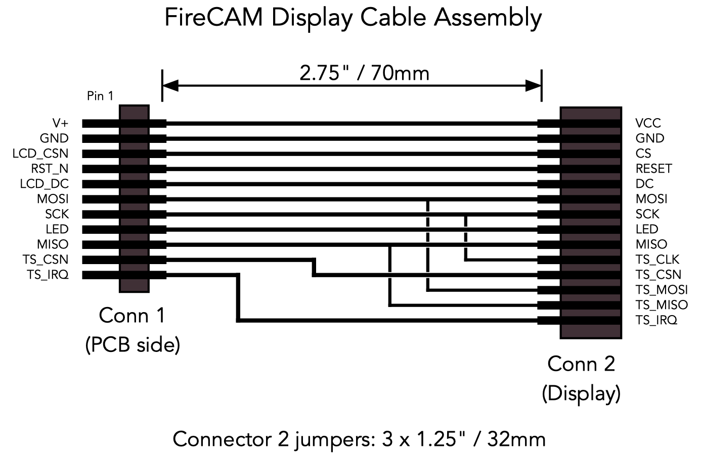

## FireCAM Hardware
This directory contains hardware design files.  Schematic entry and PCB layout was done using Eagle 7.7.

* display_mount - DXF and SVG files for a laser cut plastic display mount, OpenSCAD and STL files for a 3-piece 3D printed base and display mount.
* documentation - BOM, schematic, PCB image and helpful list of componentst to load on the PCB.
* eagle - Schematic and PCB Layout design files.
* gerber - PCB gerber files
* stencil - Stencil gerber files

### Parts
Two shared Mouser BOMs are available for most of the components.

1. [FireCAM Rev 3 PCB Parts](https://www.mouser.com/ProjectManager/ProjectDetail.aspx?AccessID=e3b4e6fe5d) - Parts for direct mounting on the PCB.
2. [FireCAM Rev 3 Assembly Parts](https://www.mouser.com/ProjectManager/ProjectDetail.aspx?AccessID=ba0938d0f0) - Additional assembly parts.

In addition a commonly available 2.8" ILI9341/XPT2046 LCD display is used.  I have successfully sourced many units from the [HiLetGo](https://www.amazon.com/HiLetgo-240X320-Resolution-Display-ILI9341/dp/B073R7BH1B) store on Amazon but they are available from many sources.  You will also need some flexible 28 AWG silicon hook-up wire and heat shrink to make the Temperature Sensor and LCD wiring harnesses and a Micro-SD Card.

### Main PCB

### Subassemblies

#### Temperature probe
The TMP36 temperature sensor is connected to a 3-pin male 0.1" (2.54mm) using 3 2" (51 mm) 28 AWG wires.  Heatshrink each individual connection and the wire assembly to each of the connector and temperature sensor.  Note the orientation of the sensor relative to the connections on the PCB.

#### Display wiring harness
The Display harness contains the shared SPI bus for the LCD and Touchscreen, control, and power signals.  The shared SPI bus signals are connected at the display side in order to minimize signal reflections.
 

#### 3D Printed Base and Display Mount
A base and two-piece display mount may be printed by slicing the STL files for your particular printer.  The STL was generated using OpenSCAD and the source files included here.

#### Laser Cut Display Mount
The display mount is designed to be cut from a piece of 1/8" plastic on a laser cutter.

### Enclosure
FireCAM is released without an enclosure as the original client for the project built their own custom enclosure for it.

### Expansion Ports

1. I2C Bus
2. ADC inputs A0 and A1 (not currently used by the firmware)

### Important Notes

1. Do not insert the LiPo battery backwards!  This will damage the camera electronics.
2. The RTC has a higher-than normal draw from the coin cell until it has been initialized.  Load firmware before inserting the coin cell and then immediately power on the camera to initialize the RTC (even if it has the wrong time).
3. Do not enable WiFi unless the antenna is connected.  It is possible to damage the ESP32 without an antenna.
4. The camera is charged from the USB port.  It will take a maximum of 500 mA from this port if it detects a charger attached (D+ connected to D-) or the USB port has been enumerated by an attached computer.  It will take a maximum of 100 mA from this port when attached to a computer but not enumerated.  It will suspect power draw when the USB bus is suspended (e.g. computer is put to sleep).  Current is shared between charging the battery and power the camera so the battery will charge faster if the camera is powered off.  The red LED lights while charging.  It will not charge if D+/D- are not connected together or connected to a computer USB port.  Most USB chargers will work.