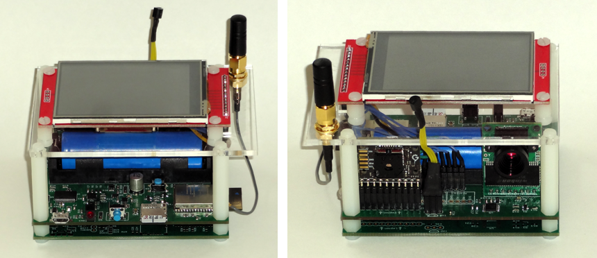
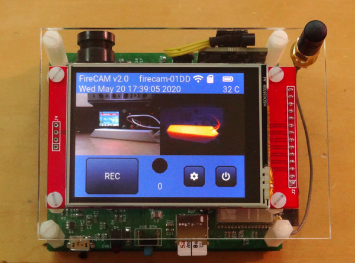
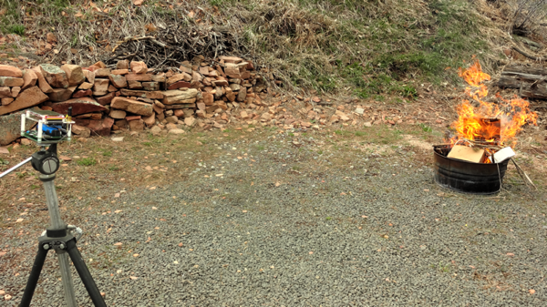
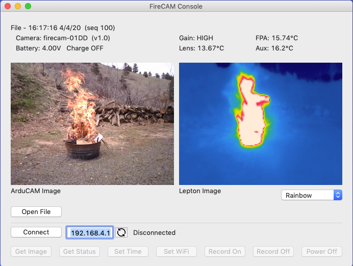
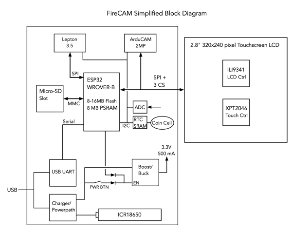

## FireCAM - Timelapse thermal imaging camera

FireCAM is a timelapse camera designed to take both visual and radiometric thermal images periodically and record them as json-structured files to a local Micro-SD Card.  The visual images are stored in jpeg format.  The thermal images are the raw radiometric data (temperature) to enable later analysis.  The camera includes a touch LCD control panel and a WiFi interface allowing control, configuration and grabbing of images from an external application.

### Features
* 160 x 120 pixel Radiometric Thermal Imaging Camera.
* 640 x 480 pixel Visual Imaging Camera.
* 2.8" 320 x 240 pixel Touchscreen for local control and configuration.
* Temperature sensor for external Thermal Imaging lens temp measurements.
* Micro-SD Card for image storage.
* Configurable timelapse times from 1 second to 1 hour per image.
* USB interface for charging, firmware updates and diagnostic output.
* 2500 mA LiPo battery with built-in charger can provide up to 5-6 hours of run-time and automatic low-battery shutdown.  Charger includes battery temperature monitor for charge limiting in extreme conditions.
* Wifi - AP or Client modes - for remote access.
* Battery-backed RTC for time and parameter storage.

### Origin
FireCAM was designed for the Joe O'Brien at [U.S. Forest Service Southern Research Station](https://www.srs.fs.usda.gov/).  It is released as Open Source software and hardware under the GPLv3 license.  The hardware design, firmware and a simple control application are contained in this repository.

### Block Diagram
FireCAM 's image system is based around a FLiR Lepton 3.5 thermal imaging module and an ArduCAM visual sensor.  It uses an Espressif ESP32 micro-controller.  Firmware is written in C using the Esspressif v3.3.2 IDF and the LittlevGL v6.1.1 GUI library.  The desktop application is written using the Xojo cross-platform development tool.

### Version
This repository currently contains:

* Hardware Design Version: 3
* Firmware Revision: 2.0
* FireCAM Application Revision: 2.0

### Digital Object Identifier

### Questions
FireCAM was designed by Dan Julio (dan@danjuliodesigns.com).  Units may be available for purchase for qualified customers.  Customizations of the hardware, firmware or application are possible.